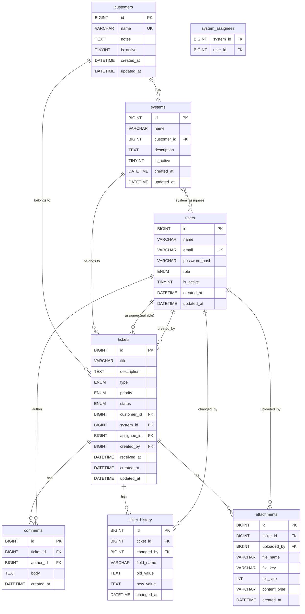

# ER図

**文書バージョン：** 1.0
**作成日：** 2026-05-10
**ステータス：** 確定

## 改訂履歴

| バージョン | 日付 | 変更内容 |
|-----------|------|---------|
| 1.0 | 2026-05-10 | 初版作成 |

---

## ER図（Mermaid）

---

## テーブル一覧

| テーブル名 | 概要 |
|---|---|
| `customers` | 顧客企業マスター |
| `systems` | システムマスター（顧客企業に紐づく） |
| `users` | ユーザーマスター（担当者・管理者） |
| `system_assignees` | システム担当者プール（中間テーブル） |
| `tickets` | チケット（問い合わせ本体） |
| `comments` | コメント（対応履歴） |
| `ticket_history` | 変更履歴（監査ログ） |
| `attachments` | 添付ファイル（S3参照） |

---

## 主なリレーション補足

| リレーション | カーディナリティ | 備考 |
|---|---|---|
| customers → systems | 1:N | 1顧客が複数システムを持つ |
| customers → tickets | 1:N | チケットには顧客が必ず紐づく |
| systems → tickets | 1:N | チケットにはシステムが必ず紐づく |
| systems ↔ users | M:N | `system_assignees` 中間テーブルで管理 |
| users → tickets（assignee） | 1:N | 担当者は省略可（NULL許容） |
| users → tickets（created_by） | 1:N | チケット作成者（必須） |
| tickets → comments | 1:N | コメントは時系列順で表示 |
| tickets → ticket_history | 1:N | フィールド変更ごとに1レコード記録 |
| tickets → attachments | 1:N | 添付ファイルのS3パスを管理 |
