# 画面仕様書：問い合わせ管理システム（MVP）

**文書バージョン：** 1.0
**作成日：** 2026-05-10
**対応する遷移図：** [画面遷移図](./画面遷移図.md)

---

## 共通レイアウト

ログイン後のすべての画面に適用される共通レイアウト。

### サイドバー

| 要素 | 説明 |
|------|------|
| ロゴ | 「Support Ops Hub」ヘッドセットアイコン付き |
| **サマリセクション** | |
| ダッシュボード | SCR-02 へ遷移 |
| 問い合わせ一覧 | SCR-03 へ遷移（フィルタリセット） |
| **顧客・システムセクション** | |
| 顧客企業（アコーディオン） | クリックで展開／折畳。企業名クリックで顧客レポート（SCR-06）へ |
| システム（サブメニュー） | 未完了件数バッジ付き。クリックでシステムダッシュボード（SCR-07）へ |
| **マスタ管理セクション** | 管理者のみ表示 |
| 顧客企業 | SCR-08 へ遷移 |
| システム | SCR-10 へ遷移 |
| ユーザー管理 | SCR-12 へ遷移 |
| **フッター** | |
| ユーザー名 | 管理者バッジ（ティール色）または担当者バッジ（グレー）を併記 |
| ログアウト | ログイン画面（SCR-01）へ遷移 |

### ページヘッダー

| 要素 | 説明 |
|------|------|
| ページタイトル | 現在の画面名（動的に変更） |
| ページアクションエリア | 「新規登録」等のページ固有ボタンを配置（画面ごとに異なる） |

### ブランドカラー

| 用途 | カラーコード |
|------|-------------|
| プライマリ（ダークティール） | `#005461` |
| セカンダリ（ティール） | `#018790` |
| アクセント（ライトティール） | `#00B7B5` |
| 背景 | `#F4F4F4` |

---

## SCR-01 ログイン

**概要：** メールアドレスとパスワードによる認証画面。ログイン前唯一のページ。

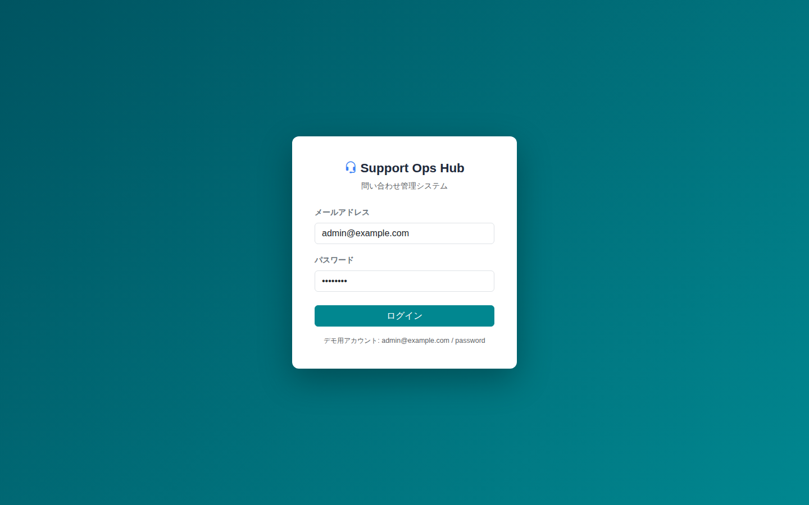

### レイアウト

画面中央にカードを配置（グラデーション背景：`#005461` → `#018790`）。

### 構成要素

| 要素 | 種別 | 内容 |
|------|------|------|
| システム名 | テキスト | 「Support Ops Hub」ヘッドセットアイコン付き |
| サブタイトル | テキスト | 「問い合わせ管理システム」 |
| メールアドレス | 入力フォーム | type="email"、必須 |
| パスワード | 入力フォーム | type="password"、必須 |
| ログインボタン | ボタン（プライマリ） | 押下でバリデーション＋認証処理 |
| デモ用アカウント | テキスト（補足） | `admin@example.com / password` |

### バリデーション・エラー

| 条件 | メッセージ |
|------|-----------|
| メールまたはパスワード不一致 | 「メールアドレスまたはパスワードが正しくありません」（アラート） |
| 無効ユーザー | 同上 |

### 遷移

| 条件 | 遷移先 |
|------|--------|
| 認証成功 | SCR-02 ダッシュボード |

---

## SCR-02 ダッシュボード

**概要：** 全問い合わせのサマリと推移を可視化するホーム画面。

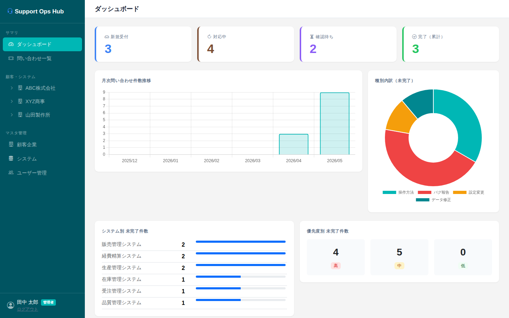

### ページアクション

なし

### 構成要素

#### ステータスカード（4枚）

| カード | ボーダー色 | 値 | クリック時 |
|--------|-----------|-----|-----------|
| 新規受付 | `#3b82f6`（青） | 新規件数 | SCR-03（ステータス＝新規フィルタ済み） |
| 対応中 | `#7c4d33`（ブラウン） | 対応中件数 | SCR-03（ステータス＝対応中フィルタ済み） |
| 確認待ち | `#8b5cf6`（紫） | 確認待ち件数 | SCR-03（ステータス＝確認待ちフィルタ済み） |
| 完了（累計） | `#22c55e`（緑） | 完了件数 | クリックなし |

#### グラフ

| グラフ | 種別 | 内容 |
|--------|------|------|
| 月次問い合わせ件数推移 | 棒グラフ（Chart.js） | 過去6ヶ月の月別件数 |
| 種別内訳（未完了） | ドーナツグラフ（Chart.js） | 操作方法・バグ報告・設定変更・データ修正 |

#### 集計テーブル

| テーブル | 内容 |
|---------|------|
| システム別 未完了件数 | システム名・件数・プログレスバー。未完了上位6件 |
| 優先度別 未完了件数 | 高・中・低の件数カード |

---

## SCR-03 問い合わせ一覧

**概要：** 全問い合わせをフィルタリングして一覧表示するメイン操作画面。

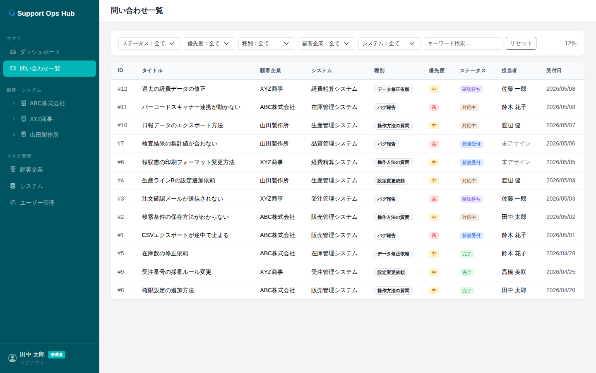

### ページアクション

なし（新規登録はSCR-07システムダッシュボードから）

### 構成要素

#### フィルターバー

| 項目 | 種別 | 連動 |
|------|------|------|
| ステータス | セレクトボックス | - |
| 優先度 | セレクトボックス | - |
| 種別 | セレクトボックス | - |
| 顧客企業 | セレクトボックス | 選択するとシステム候補を絞り込み |
| システム | セレクトボックス | 顧客企業選択と連動 |
| キーワード検索 | テキスト入力 | タイトル・詳細内容を対象 |
| リセットボタン | ボタン（アウトライン） | 全フィルタをクリア |
| 件数表示 | テキスト | 「N件」をフィルター右端に表示 |

#### チケット一覧テーブル

| カラム | 内容 |
|--------|------|
| ID | `#{id}` |
| タイトル | 問い合わせタイトル（太字） |
| 顧客企業 | 顧客企業名 |
| システム | システム名 |
| 種別 | バッジ（ライトグレー） |
| 優先度 | カラーバッジ（高：赤、中：黄、低：緑） |
| ステータス | カラーバッジ |
| 担当者 | 担当者名または「未アサイン」（グレー） |
| 受付日 | `YYYY/MM/DD` |

- 行全体クリックで SCR-04 詳細へ遷移
- 受付日降順で表示
- 該当なし時は「該当する問い合わせがありません」を表示

#### ステータスバッジ定義

| ステータス | 背景色 | 文字色 |
|-----------|--------|--------|
| 新規受付 | `#dbeafe` | `#1d4ed8` |
| 対応中 | `#f5ede4` | `#7c4d33` |
| 確認待ち | `#ede9fe` | `#7c3aed` |
| 完了 | `#dcfce7` | `#166534` |

---

## SCR-04 問い合わせ詳細

**概要：** 1件のチケットの全情報を表示・操作するメイン詳細画面。

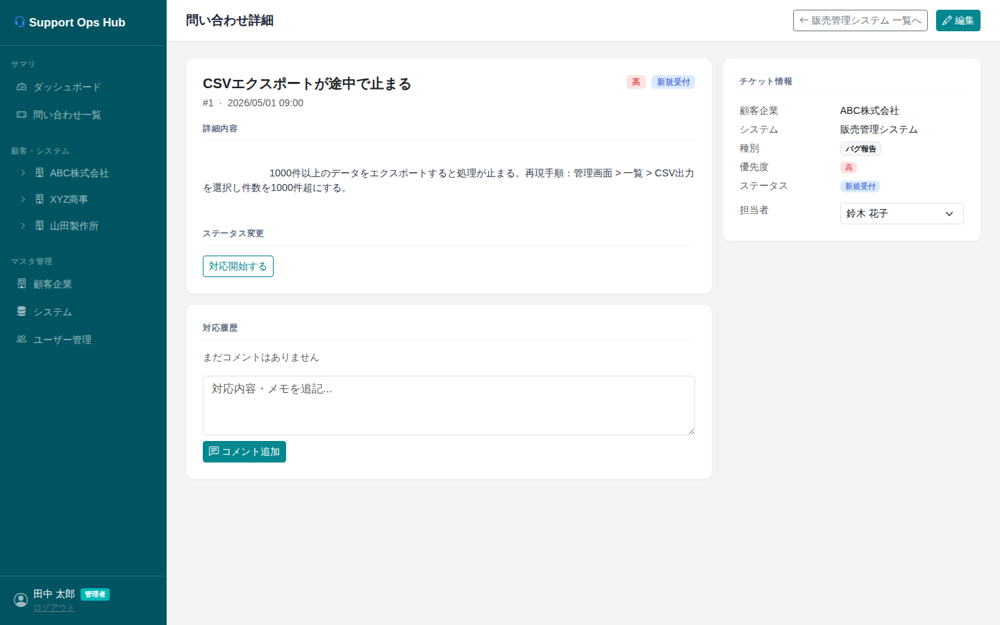

### ページアクション

| ボタン | 動作 |
|--------|------|
| 「{システム名} 一覧へ」（アウトライン） | SCR-07 対象システムのダッシュボードへ戻る。ボタンラベルにはチケットのシステム名を動的表示 |
| 「編集」（プライマリ） | SCR-05 問い合わせ編集モーダルを開く |

### レイアウト

左カラム（8/12）：メイン情報・対応履歴  
右カラム（4/12）：チケット情報サイドバー

### 左カラム：メイン情報カード

| 要素 | 内容 |
|------|------|
| タイトル | 問い合わせタイトル（太字大） |
| サブ情報 | `#{id}` ・ 受付日時 |
| 優先度バッジ | 右端に表示 |
| ステータスバッジ | 右端に表示 |
| 詳細内容 | 改行を保持して表示 |
| **ステータス変更ボタン** | 現在ステータスに応じて表示するボタンが変わる（下表参照） |

#### ステータス変更ボタン定義

| 現在のステータス | 表示ボタン |
|----------------|-----------|
| 新規受付 | 「対応開始する」→ 対応中 |
| 対応中 | 「確認待ちへ」→ 確認待ち、「完了にする」→ 完了 |
| 確認待ち | 「対応再開する」→ 対応中、「完了にする」→ 完了 |
| 完了 | 「再オープン」→ 対応中 |

### 左カラム：対応履歴カード

| 要素 | 内容 |
|------|------|
| コメント一覧 | 投稿者名・日時・テキスト（時系列） |
| コメント追加テキストエリア | プレースホルダー「対応内容・メモを追記...」 |
| 「コメント追加」ボタン | 未入力時は処理しない |

### 右カラム：チケット情報

| 項目 | 種別 | 備考 |
|------|------|------|
| 顧客企業 | テキスト | 読み取り専用 |
| システム | テキスト | 読み取り専用 |
| 種別 | バッジ | 読み取り専用 |
| 優先度 | バッジ | 読み取り専用 |
| ステータス | バッジ | 読み取り専用 |
| 担当者 | セレクトボックス | システムの担当者プールから選択。変更即時保存 |

---

## SCR-05 問い合わせ登録・編集モーダル

**概要：** チケットの新規登録および既存チケットの編集を行うモーダル（Bootstrap Modal）。

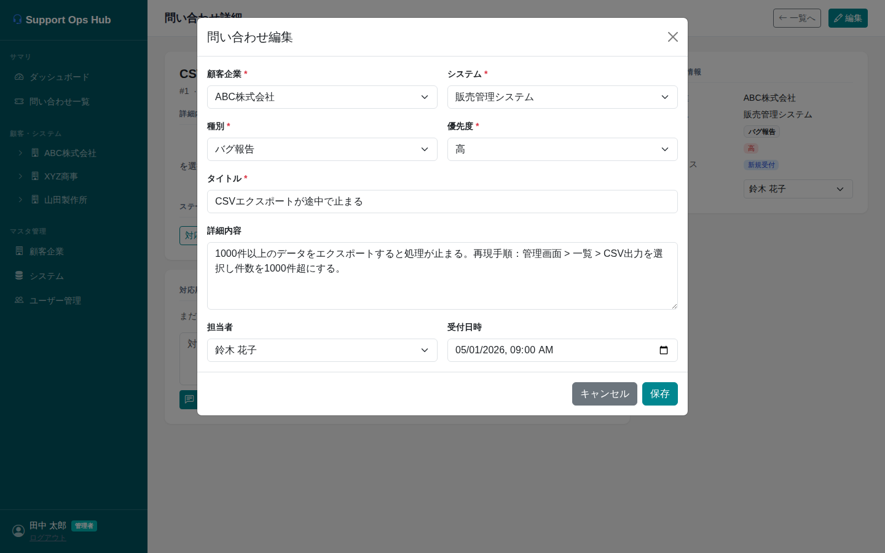

### モーダルタイトル

- 新規登録時：「問い合わせ登録」
- 編集時：「問い合わせ編集」

### フォーム項目

| 項目 | 種別 | 必須 | 備考 |
|------|------|------|------|
| 顧客企業 | セレクトボックス | ✅ | 変更でシステム候補・担当者候補を連動更新 |
| システム | セレクトボックス | ✅ | 顧客企業選択後に候補絞り込み。変更で担当者候補を連動更新 |
| 種別 | セレクトボックス | ✅ | 変更で優先度のデフォルト値を自動セット |
| 優先度 | セレクトボックス | ✅ | 高・中・低。種別選択後にデフォルト値を自動セット（手動変更可） |
| タイトル | テキスト入力 | ✅ | プレースホルダー「問い合わせの概要」 |
| 詳細内容 | テキストエリア（4行） | - | プレースホルダー「詳細・再現手順など...」 |
| 担当者 | セレクトボックス | - | システム選択後に担当者プールから候補表示 |
| 受付日時 | datetime-local | - | 登録時は現在日時をデフォルトセット |

### 優先度デフォルト値（種別選択時の自動セット）

| 種別 | デフォルト優先度 |
|------|----------------|
| バグ報告 | 高 |
| 操作方法の質問 | 中 |
| 設定変更依頼 | 中 |
| データ修正依頼 | 中 |

### バリデーション

| 条件 | 処理 |
|------|------|
| 必須項目（顧客企業・システム・種別・優先度・タイトル）が未入力 | 「必須項目をすべて入力してください」アラート |

### フッターボタン

| ボタン | 動作 |
|--------|------|
| 「キャンセル」（セカンダリ） | モーダルを閉じる |
| 「保存」（プライマリ） | バリデーション後に保存。編集時はSCR-04へ、新規登録時はSCR-07（対象システムダッシュボード）へ |

---

## SCR-06 顧客レポート

**概要：** 特定顧客企業の問い合わせ集計・推移を表示するレポート画面。サイドバーの顧客企業名クリックで遷移。

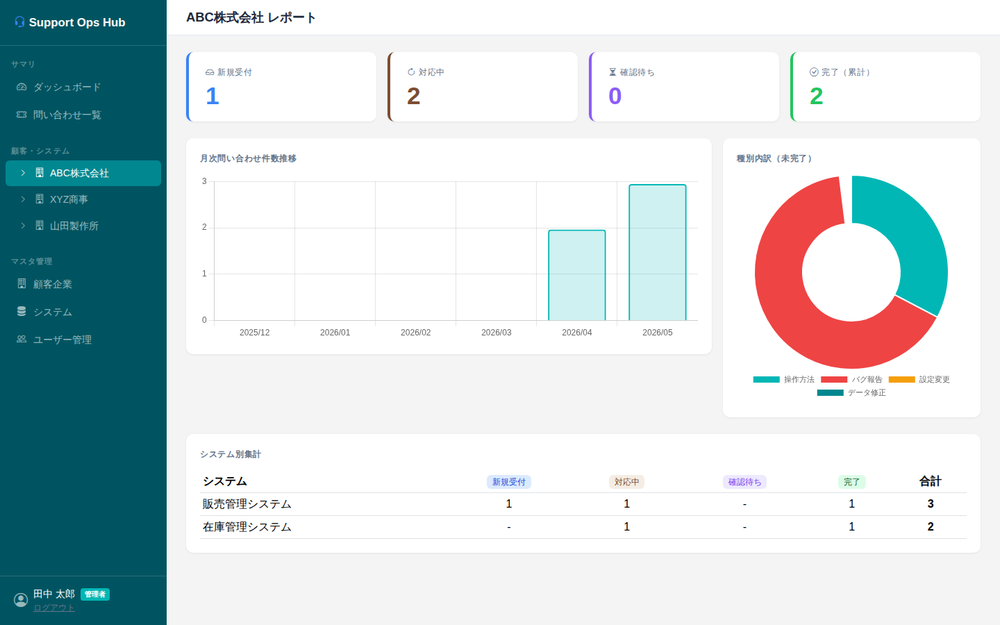

### ページタイトル

「{顧客企業名} レポート」（動的）

### ページアクション

なし

### 構成要素

| 要素 | 内容 |
|------|------|
| ステータスカード（4枚） | 新規受付・対応中・確認待ち・完了（当該顧客企業のみ集計） |
| 月次件数推移グラフ | 棒グラフ（過去6ヶ月、当該顧客企業のみ） |
| 種別内訳ドーナツグラフ | 未完了チケットを種別で分類 |
| システム別集計テーブル | システムごとに新規受付・対応中・確認待ち・完了・合計を表示 |

---

## SCR-07 システムダッシュボード

**概要：** 特定システムの問い合わせ一覧と統計を表示する画面。サイドバーのシステム名クリックで遷移。

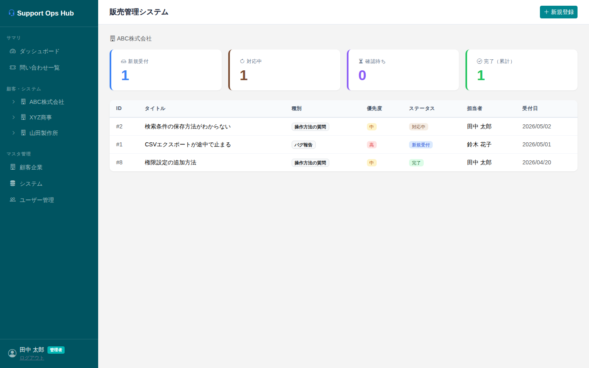

### ページタイトル

「{システム名}」（動的）

### ページアクション

| ボタン | 動作 |
|--------|------|
| 「新規登録」（プライマリ） | SCR-05 問い合わせ登録モーダルを開く |

### 構成要素

| 要素 | 内容 |
|------|------|
| 顧客企業名 | ビルアイコン付きで表示（ページタイトル直下） |
| ステータスカード（4枚） | 新規受付・対応中・確認待ち・完了（当該システムのみ集計） |
| チケット一覧テーブル | ID・タイトル・種別・優先度・ステータス・担当者・受付日。行クリックでSCR-04へ |

- チケットなし時は「問い合わせはありません」を表示
- 受付日降順で表示

---

## SCR-08 顧客企業マスタ

**概要：** 顧客企業の一覧表示・管理画面。管理者専用。

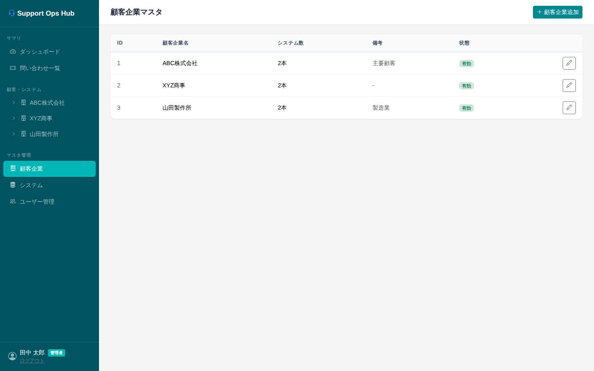

### ページアクション

| ボタン | 動作 |
|--------|------|
| 「顧客企業追加」（プライマリ） | SCR-09 顧客企業登録モーダルを開く |

### テーブル

| カラム | 内容 |
|--------|------|
| ID | 顧客企業ID |
| 顧客企業名 | （太字） |
| システム数 | 紐づくシステムの総数（有効・無効含む）|
| 備考 | 備考テキスト |
| 状態 | 有効（緑バッジ）/ 無効（グレーバッジ） |
| 操作 | 「編集」ボタン → SCR-09 |

---

## SCR-09 顧客企業登録・編集モーダル

**概要：** 顧客企業の新規追加および編集を行うモーダル。管理者専用。

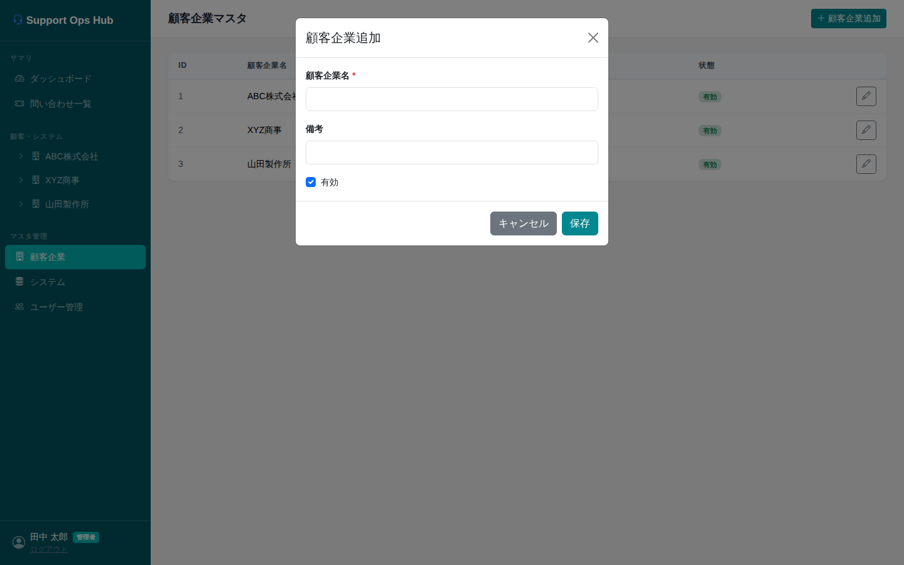

### モーダルタイトル

- 新規登録時：「顧客企業追加」
- 編集時：「顧客企業編集」

### フォーム項目

| 項目 | 種別 | 必須 | バリデーション |
|------|------|------|--------------|
| 顧客企業名 | テキスト入力 | ✅ | 未入力時「顧客企業名を入力してください」アラート |
| 備考 | テキスト入力 | - | - |
| 有効 | チェックボックス | - | デフォルトON |

### フッターボタン

| ボタン | 動作 |
|--------|------|
| 「キャンセル」（セカンダリ） | モーダルを閉じる |
| 「保存」（プライマリ） | 保存後モーダルを閉じてSCR-08を更新 |

---

## SCR-10 システムマスタ

**概要：** システムの一覧表示・管理画面。管理者専用。

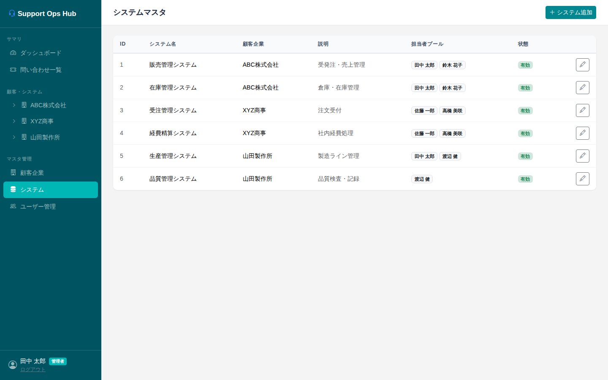

### ページアクション

| ボタン | 動作 |
|--------|------|
| 「システム追加」（プライマリ） | SCR-11 システム登録モーダルを開く |

### テーブル

| カラム | 内容 |
|--------|------|
| ID | システムID |
| システム名 | （太字） |
| 顧客企業 | 紐づく顧客企業名 |
| 説明 | システム説明 |
| 担当者プール | 担当者名バッジの一覧 |
| 状態 | 有効（緑バッジ）/ 無効（グレーバッジ） |
| 操作 | 「編集」ボタン → SCR-11 |

---

## SCR-11 システム登録・編集モーダル

**概要：** システムの新規追加および編集を行うモーダル。管理者専用。

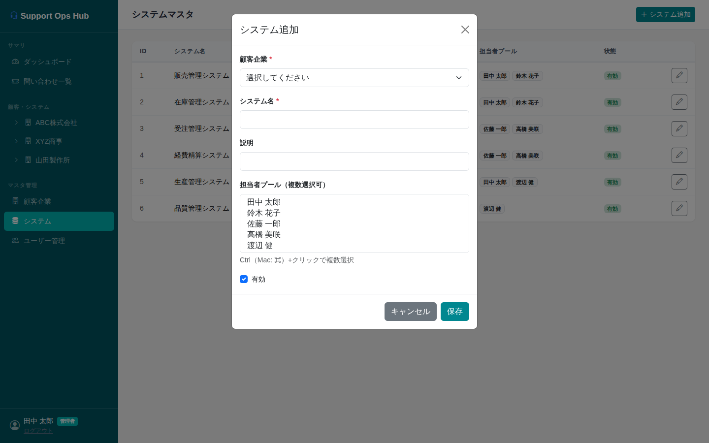

### モーダルタイトル

- 新規登録時：「システム追加」
- 編集時：「システム編集」

### フォーム項目

| 項目 | 種別 | 必須 | 備考 |
|------|------|------|------|
| 顧客企業 | セレクトボックス | ✅ | 新規時のみ変更可。編集時はdisabledで表示（変更不可） |
| システム名 | テキスト入力 | ✅ | 同一顧客企業内でユニーク |
| 説明 | テキスト入力 | - | - |
| 担当者プール | 複数選択リスト（height:120px） | - | Ctrl/⌘+クリックで複数選択 |
| 有効 | チェックボックス | - | デフォルトON |

### バリデーション

| 条件 | 処理 |
|------|------|
| 顧客企業またはシステム名が未入力 | 「必須項目を入力してください」アラート |
| 同一顧客企業内に同名システムが存在 | 「同じ顧客企業内に同名のシステムが既に存在します」アラート |

### フッターボタン

| ボタン | 動作 |
|--------|------|
| 「キャンセル」（セカンダリ） | モーダルを閉じる |
| 「保存」（プライマリ） | 保存後モーダルを閉じてSCR-10を更新 |

---

## SCR-12 ユーザー管理

**概要：** ユーザー（担当者）の一覧表示画面。管理者専用。現バージョンは閲覧のみ（追加・編集は将来対応）。

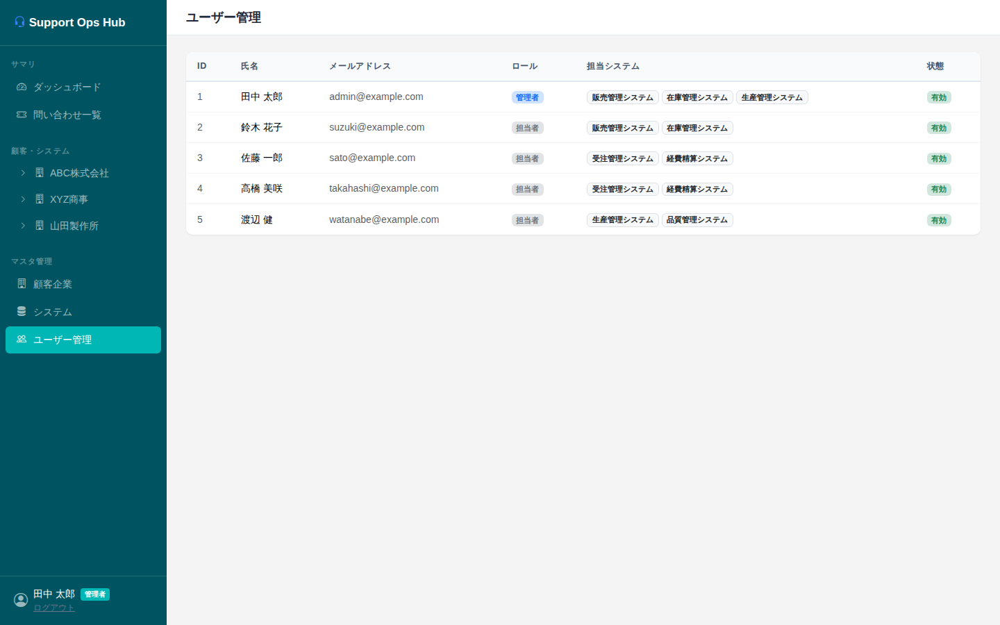

### ページアクション

なし（MVP では閲覧のみ）

### テーブル

| カラム | 内容 |
|--------|------|
| ID | ユーザーID |
| 氏名 | （太字） |
| メールアドレス | ログインID |
| ロール | 管理者（青バッジ）/ 担当者（グレーバッジ） |
| 担当システム | 担当者プールに含まれるシステム名バッジ |
| 状態 | 有効（緑バッジ）/ 無効（グレーバッジ） |
