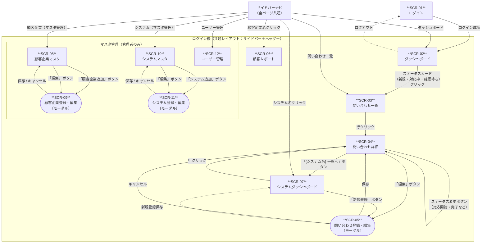

# 画面遷移図：問い合わせ管理システム（MVP）

**文書バージョン：** 1.0
**作成日：** 2026-05-10
**対応する仕様書：** [画面仕様書](./画面仕様書.md)

---

## 画面一覧

| 画面ID | 画面名 | 種別 | アクセス権 |
|--------|--------|------|-----------|
| SCR-01 | ログイン | ページ | 全員 |
| SCR-02 | ダッシュボード | ページ | 全員 |
| SCR-03 | 問い合わせ一覧 | ページ | 全員 |
| SCR-04 | 問い合わせ詳細 | ページ | 全員 |
| SCR-05 | 問い合わせ登録・編集 | モーダル | 全員 |
| SCR-06 | 顧客レポート | ページ | 全員 |
| SCR-07 | システムダッシュボード | ページ | 全員 |
| SCR-08 | 顧客企業マスタ | ページ | 管理者のみ |
| SCR-09 | 顧客企業登録・編集 | モーダル | 管理者のみ |
| SCR-10 | システムマスタ | ページ | 管理者のみ |
| SCR-11 | システム登録・編集 | モーダル | 管理者のみ |
| SCR-12 | ユーザー管理 | ページ | 管理者のみ |

---

## 遷移図

---

## 遷移トリガー一覧

| 起点 | 終点 | トリガー | 条件 |
|------|------|----------|------|
| SCR-01 | SCR-02 | ログインボタン | 認証成功 |
| SCR-02 | SCR-01 | ログアウトリンク | - |
| SCR-02 | SCR-03 | ステータスカードクリック | 新規受付・対応中・確認待ち |
| SCR-03 | SCR-04 | テーブル行クリック | - |
| SCR-04 | SCR-07 | 「{システム名} 一覧へ」ボタン | チケットのシステムIDでSCR-07へ遷移 |
| SCR-04 | SCR-05 | 「編集」ボタン | - |
| SCR-04 | SCR-04 | ステータス変更ボタン | 遷移可能なステータスのみ表示 |
| SCR-04 | SCR-04 | コメント追加 | - |
| SCR-04 | SCR-04 | 担当者変更 | - |
| SCR-05 | SCR-04 | 「保存」ボタン（編集時） | バリデーション通過 |
| SCR-05 | SCR-07 | 「保存」ボタン（新規登録時） | バリデーション通過。対象システムのダッシュボードへ |
| SCR-05 | 元の画面 | 「キャンセル」ボタン | - |
| SCR-07 | SCR-04 | テーブル行クリック | - |
| SCR-07 | SCR-05 | 「新規登録」ボタン | - |
| SCR-08 | SCR-09 | 「顧客企業追加」ボタン | - |
| SCR-08 | SCR-09 | 「編集」ボタン | - |
| SCR-09 | SCR-08 | 「保存」ボタン | バリデーション通過 |
| SCR-09 | SCR-08 | 「キャンセル」ボタン | - |
| SCR-10 | SCR-11 | 「システム追加」ボタン | - |
| SCR-10 | SCR-11 | 「編集」ボタン | - |
| SCR-11 | SCR-10 | 「保存」ボタン | バリデーション通過 |
| SCR-11 | SCR-10 | 「キャンセル」ボタン | - |
| サイドバー | SCR-02 | ダッシュボード | - |
| サイドバー | SCR-03 | 問い合わせ一覧 | - |
| サイドバー | SCR-06 | 顧客企業名クリック | - |
| サイドバー | SCR-07 | システム名クリック | - |
| サイドバー | SCR-08 | 顧客企業（マスタ管理） | 管理者のみ表示 |
| サイドバー | SCR-10 | システム（マスタ管理） | 管理者のみ表示 |
| サイドバー | SCR-12 | ユーザー管理 | 管理者のみ表示 |
